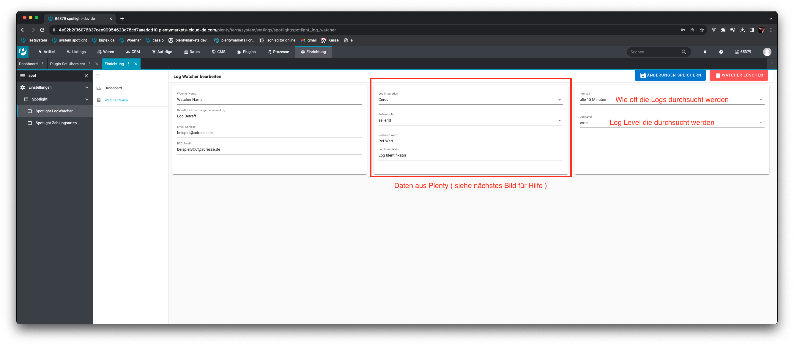
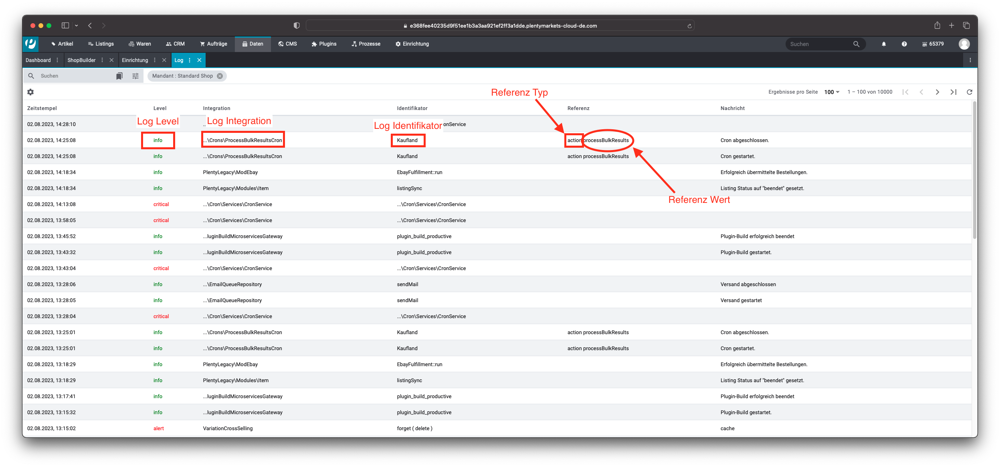

# Spotlight Log Watcher
Dieses Plugin ermöglicht Ihnen, Logs in ihrem System zu überwachen indem sie diese Per Email zugeschickt bekommen

## Installation & Einrichtung
1. Gehen Sie zuerst auf **Plugins » Plugin-Set-Übersicht**.
2. Wählen Sie das Plugin-Set aus , in welchem Sie unser Plugin installieren wollen.
3. Gehen Sie nun auf **Plugin hinzufügen**, dann wählen Sie unser Plugin aus und Drücken auf Installieren.
   
4. **Aktivieren** Sie das installierte Plugin.
5. Jetzt ist das Plugin bereits funktionsfähig
6. Konfigurieren Sie Ihre Log Watcher

### Konfiguration eines Watchers
1. Gehen Sie auf **Einrichtung** und suchen Sie unter **SpotLight** den **Spotlight LogWatcher** oder suchen sie einfach
   **Spotlight LogWatcher** und wählen diesen aus.
   
2. Wenn Sie sich in der Benutzer Oberfläche befinden klicken Sie  **Neuen Watcher erstellen**.
   
3. Füllen Sie die Watcher Daten aus ( siehe Bilder )
   
   
4. Jetzt müssen Sie nur noch auf "Erstellen" drücken

####-Dashboard mit Übersicht über alle Konfigurierten Cross Seller:
   - Im Überpunkt "Dashboard" der Oberfläche finden Sie alle bereits konfigurierten Watcher.
     
####-Aktualisieren und löschen von Konfigurationen:
   - Um eine Konfiguration zu löschen wählen Sie einfach den Watcher aus,
     welcher gelöscht werden soll und klicken auf den "Watcher Löschen" Button
     
   
Aktualisieren:
   - Um eine Konfiguration zu aktualisieren klicken Sie den gewünschten Watcher im Dashboard an.
   
   - Dann ändern Sie die gewünschen Werte und speichern diese ab indem sie den "Änderungen Speicher" Button drücken
   
## Beispiel für konfigurierte Watcher

###UI:

###EMAIL:

